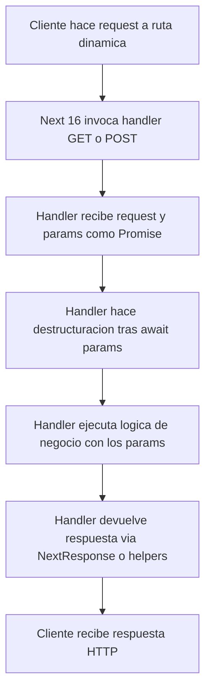

# Plan de refactor: handlers de rutas Next 16 con params como Promise

## 1. Contexto y objetivo

Next 16 cambia la firma recomendada de los handlers de rutas en el App Router para rutas dinámicas: el objeto `params` se expone como una `Promise`. El ejemplo de la documentación es:

```ts
// app/dashboard/[team]/route.ts
export async function GET(
  request: Request,
  { params }: { params: Promise<{ team: string }> }
) {
  const { team } = await params;
}
```

En este proyecto, varios handlers en `src/app/api` usan `params` como objeto síncrono, lo que puede generar errores o incompatibilidades al actualizar a Next 16. El objetivo de este plan es:

- Actualizar las firmas de los handlers con parámetros de ruta para que usen `params` como `Promise`.
- Mantener intacta la lógica de negocio actual.
- Adaptar los tests de rutas para seguir funcionando con la nueva firma.

Este documento describe los cambios que deberá aplicar el modo de código sobre los archivos de `src/app/api` y sus tests.

---

## 2. Alcance del cambio

### 2.1 Endpoints afectados (con params en la ruta)

- [`src/app/api/games/[roomId]/words/route.ts`](src/app/api/games/[roomId]/words/route.ts)
  - Handler [`POST()`](src/app/api/games/[roomId]/words/route.ts:7)
- [`src/app/api/rooms/[code]/route.ts`](src/app/api/rooms/[code]/route.ts)
  - Handler [`GET()`](src/app/api/rooms/[code]/route.ts:5)
- [`src/app/api/rooms/[code]/end/route.ts`](src/app/api/rooms/[code]/end/route.ts)
  - Handler [`POST()`](src/app/api/rooms/[code]/end/route.ts:11)
- [`src/app/api/rooms/[code]/join/route.ts`](src/app/api/rooms/[code]/join/route.ts)
  - Handler [`POST()`](src/app/api/rooms/[code]/join/route.ts:8)
- [`src/app/api/rooms/[code]/leave/route.ts`](src/app/api/rooms/[code]/leave/route.ts)
  - Handler [`POST()`](src/app/api/rooms/[code]/leave/route.ts:7)
- [`src/app/api/rooms/[code]/start/route.ts`](src/app/api/rooms/[code]/start/route.ts)
  - Handler [`POST()`](src/app/api/rooms/[code]/start/route.ts:7)

### 2.2 Endpoints no afectados (sin params)

No requieren cambios por el tema de `params`:

- [`src/app/api/db/migrate/route.ts`](src/app/api/db/migrate/route.ts)
  - [`POST()`](src/app/api/db/migrate/route.ts:4)
- [`src/app/api/dictionary/status/route.ts`](src/app/api/dictionary/status/route.ts)
  - [`GET()`](src/app/api/dictionary/status/route.ts:4)
- [`src/app/api/health/route.ts`](src/app/api/health/route.ts)
  - [`GET()`](src/app/api/health/route.ts:7)
- [`src/app/api/rooms/route.ts`](src/app/api/rooms/route.ts)
  - [`POST()`](src/app/api/rooms/route.ts:9)

---

## 3. Patrón de firma objetivo para Next 16

### 3.1 Firma general para rutas con params

Patrón recomendado para cualquier handler con segmentos dinámicos:

```ts
export async function GET(
  request: Request | NextRequest,
  { params }: { params: Promise<{ param1: string; param2?: string }> }
) {
  const { param1, param2 } = await params;
  // lógica existente usando param1, param2...
}
```

Puntos clave:

1. El segundo argumento del handler desestructura un objeto que contiene `params` como `Promise<...>`.
2. Dentro del handler, la destructuración de los parámetros de ruta se hace tras `await params`.
3. Se puede seguir usando `NextRequest` y `NextResponse` sin cambios, solo se ajusta el tipo de `params`.

### 3.2 Tipo util opcional para homogeneizar

Se puede introducir un tipo util compartido (opcional pero recomendado):

```ts
type RouteParams<T> = { params: Promise<T> };
```

Ejemplo de uso en un handler:

```ts
export async function POST(
  request: NextRequest,
  { params }: RouteParams<{ code: string }>
) {
  const { code } = await params;
  // lógica existente
}
```

Si se introduce `RouteParams`, debe hacerse en un archivo compartido adecuado (por ejemplo `src/server/types.ts` o similar) y actualizar los imports en los handlers.

---

## 4. Refactor detallado por endpoint

### 4.1 `games/[roomId]/words` POST

Archivo: [`src/app/api/games/[roomId]/words/route.ts`](src/app/api/games/[roomId]/words/route.ts)

#### 4.1.1 Cambios en la firma

Antes:

```ts
export async function POST(
  request: NextRequest,
  { params }: { params: { roomId: string } }
) {
  const roomId = params.roomId;
  // resto de la lógica
}
```

Después:

```ts
export async function POST(
  request: NextRequest,
  { params }: { params: Promise<{ roomId: string }> }
) {
  const { roomId } = await params;
  // resto de la lógica sin cambios
}
```

#### 4.1.2 Consideraciones

- No modificar la lógica de validación con `wordSubmissionSchema` ni las llamadas a `roomsManager` o `validateWord`.
- Mantener el uso de `NextResponse` tal como está.

### 4.2 `rooms/[code]` GET

Archivo: [`src/app/api/rooms/[code]/route.ts`](src/app/api/rooms/[code]/route.ts)

#### 4.2.1 Cambios en la firma

Antes:

```ts
export async function GET(
  request: NextRequest,
  { params }: { params: { code: string } }
) {
  const { code } = params;
  // lógica
}
```

Después:

```ts
export async function GET(
  request: NextRequest,
  { params }: { params: Promise<{ code: string }> }
) {
  const { code } = await params;
  // lógica existente
}
```

#### 4.2.2 Consideraciones

- Mantener el uso de `roomsManager.getRoom` y de `apiSuccess` y `apiError`.
- Es recomendable eliminar cualquier `console.log` residual en este handler para evitar ruido en producción o tests.

### 4.3 `rooms/[code]/end` POST

Archivo: [`src/app/api/rooms/[code]/end/route.ts`](src/app/api/rooms/[code]/end/route.ts)

#### 4.3.1 Cambios en la firma

Antes:

```ts
export async function POST(
  request: NextRequest,
  { params }: { params: { code: string } }
) {
  const { code } = params;
  // lógica
}
```

Después:

```ts
export async function POST(
  request: NextRequest,
  { params }: { params: Promise<{ code: string }> }
) {
  const { code } = await params;
  // misma lógica
}
```

#### 4.3.2 Consideraciones

- No cambiar la secuencia de llamadas a `roomsManager.getRoom`, `roomsManager.endGame` ni `emitGameEnded`.

### 4.4 `rooms/[code]/join` POST

Archivo: [`src/app/api/rooms/[code]/join/route.ts`](src/app/api/rooms/[code]/join/route.ts)

#### 4.4.1 Cambios en la firma

Antes:

```ts
export async function POST(
  request: NextRequest,
  { params }: { params: { code: string } }
) {
  const { code } = params;
  // lógica
}
```

Después:

```ts
export async function POST(
  request: NextRequest,
  { params }: { params: Promise<{ code: string }> }
) {
  const { code } = await params;
  // misma lógica
}
```

#### 4.4.2 Consideraciones

- Mantener la construcción de `validatedData` usando `roomCode: code`.
- No modificar la creación del `Player` ni las llamadas a `roomsManager.joinRoom` y `emitPlayerJoined`.

### 4.5 `rooms/[code]/leave` POST

Archivo: [`src/app/api/rooms/[code]/leave/route.ts`](src/app/api/rooms/[code]/leave/route.ts)

#### 4.5.1 Cambios en la firma

Antes:

```ts
export async function POST(
  request: NextRequest,
  { params }: { params: { code: string } }
) {
  const { code } = params;
  // lógica
}
```

Después:

```ts
export async function POST(
  request: NextRequest,
  { params }: { params: Promise<{ code: string }> }
) {
  const { code } = await params;
  // misma lógica
}
```

#### 4.5.2 Consideraciones

- Seguir usando `code` como `roomCode` para validación con `leaveRoomSchema` y para `roomsManager`.
- Mantener intacta la lógica de `emitPlayerLeft`.

### 4.6 `rooms/[code]/start` POST

Archivo: [`src/app/api/rooms/[code]/start/route.ts`](src/app/api/rooms/[code]/start/route.ts)

#### 4.6.1 Cambios en la firma y destructuración

Antes:

```ts
export async function POST(
  request: NextRequest,
  { params }: { params: { code: string } }
) {
  const roomCode = params.code;
  // lógica
}
``+

Después:

```ts
export async function POST(
  request: NextRequest,
  { params }: { params: Promise<{ code: string }> }
) {
  const { code: roomCode } = await params;
  // lógica existente sin más cambios
}
```

#### 4.6.2 Consideraciones

- No cambiar la lógica de validación con `startGameSchema` ni la generación del tablero con `generateBoard`.
- Mantener las llamadas a `roomsManager.startGame` y `emitGameStarted`.

---

## 5. Actualización de tests

### 5.1 Tests afectados

- [`src/app/api/games/[roomId]/words/__tests__/route.test.ts`](src/app/api/games/[roomId]/words/__tests__/route.test.ts)
- [`src/app/api/rooms/[code]/__tests__/route.test.ts`](src/app/api/rooms/[code]/__tests__/route.test.ts)
- [`src/app/api/rooms/[code]/end/__tests__/route.test.ts`](src/app/api/rooms/[code]/end/__tests__/route.test.ts)
- [`src/app/api/rooms/[code]/join/__tests__/route.test.ts`](src/app/api/rooms/[code]/join/__tests__/route.test.ts)
- [`src/app/api/rooms/[code]/leave/__tests__/route.test.ts`](src/app/api/rooms/[code]/leave/__tests__/route.test.ts)
- [`src/app/api/rooms/[code]/start/__tests__/route.test.ts`](src/app/api/rooms/[code]/start/__tests__/route.test.ts)

### 5.2 Patrón de llamada actual vs nuevo

Actualmente los tests llaman a los handlers pasando `params` como objeto síncrono. Ejemplo en `games/[roomId]/words`:

```ts
const response = await POST(request, { params: { roomId } });
```

Con la nueva firma, los tests deben pasar `params` como `Promise`:

```ts
const response = await POST(request, { params: Promise.resolve({ roomId }) });
```

Análogo para rutas con `code`:

```ts
const response = await GET(request, { params: Promise.resolve({ code }) });
```

### 5.3 Helper opcional para tests

Para reducir repetición en los tests se puede definir un helper genérico:

```ts
const makeParams = <T>(value: T) => ({ params: Promise.resolve(value) });
```

Uso en tests:

```ts
const response = await POST(request, makeParams({ roomId }));
const response = await GET(request, makeParams({ code }));
```

Este helper puede definirse dentro de cada fichero de tests o extraerse a un util común si se considera útil.

### 5.4 Consideraciones de Vitest

- No es necesario ajustar los mocks existentes (`vi.mock`) ni la configuración global de Vitest.
- Los cambios se limitan a cómo se construye el segundo argumento al invocar los handlers en los tests.

---

## 6. Consideraciones de TypeScript y compatibilidad

1. **Tipos Request y NextRequest**
   - No es obligatorio cambiar `NextRequest` por `Request` en los handlers donde ya se utiliza.
   - El cambio mínimo consiste únicamente en ajustar el tipo del segundo parámetro para que `params` sea una `Promise`.

2. **Seguridad en runtime**
   - En JavaScript, `await` sobre un valor que no es `Promise` devuelve dicho valor sin cambios.
   - Por tanto, incluso si internamente Next no pasase exactamente un `Promise` estándar, el patrón `const { code } = await params;` seguiría siendo seguro.

3. **Uso de tipo util RouteParams**
   - Introducir `RouteParams<T>` reduce duplicación y mejora la legibilidad.
   - Si se adopta, actualizar todas las firmas de handlers afectados para usarlo de forma consistente.

---

## 7. Flujo de una request con params en Next 16



---

## 8. Checklist de implementación para modo de codigo

Orden recomendado de trabajo para el modo de codigo:

1. **Actualizar firmas de handlers con params**
   - Modificar las firmas de los handlers en:
     - [`src/app/api/games/[roomId]/words/route.ts`](src/app/api/games/[roomId]/words/route.ts)
     - [`src/app/api/rooms/[code]/route.ts`](src/app/api/rooms/[code]/route.ts)
     - [`src/app/api/rooms/[code]/end/route.ts`](src/app/api/rooms/[code]/end/route.ts)
     - [`src/app/api/rooms/[code]/join/route.ts`](src/app/api/rooms/[code]/join/route.ts)
     - [`src/app/api/rooms/[code]/leave/route.ts`](src/app/api/rooms/[code]/leave/route.ts)
     - [`src/app/api/rooms/[code]/start/route.ts`](src/app/api/rooms/[code]/start/route.ts)

2. **Introducir destructuracion con await params dentro de cada handler**
   - En cada handler afectado, añadir al inicio:
     - `const { roomId } = await params;` donde corresponda.
     - `const { code } = await params;` o `const { code: roomCode } = await params;` según el nombre de variable ya existente.
   - Sustituir usos de `params.code` o `params.roomId` por las nuevas variables ya destructuradas.

3. **Opcional: introducir tipo RouteParams**
   - Crear un tipo `RouteParams<T>` en un archivo compartido adecuado.
   - Reemplazar las firmas explícitas `{ params: Promise<{ ... }> }` por `RouteParams<{ ... }>` en todos los handlers afectados.

4. **Actualizar los tests para usar params como Promise**
   - En cada test afectado de `src/app/api/**/__tests__`:
     - Cambiar llamadas tipo `POST(request, { params: { roomId } })` por `POST(request, { params: Promise.resolve({ roomId }) })`.
     - Cambiar llamadas tipo `GET(request, { params: { code } })` por `GET(request, { params: Promise.resolve({ code }) })`.
   - Opcionalmente, introducir y reutilizar el helper `makeParams` descrito en la seccion 5.3.

5. **Limpieza menor**
   - Revisar y eliminar logs de depuracion innecesarios (por ejemplo, `console.log` en [`src/app/api/rooms/[code]/route.ts`](src/app/api/rooms/[code]/route.ts)).

6. **Ejecutar la suite de tests**
   - Ejecutar los tests definidos en [`package.json`](package.json) para validar que:
     - No hay errores de tipo en TypeScript.
     - Todos los tests de rutas en `src/app/api` siguen pasando.

Con este plan, el modo de codigo puede aplicar los cambios necesarios para alinear los handlers de rutas y sus tests con el comportamiento esperado de Next 16 respecto a `params` como `Promise`, sin alterar la logica de negocio existente.

