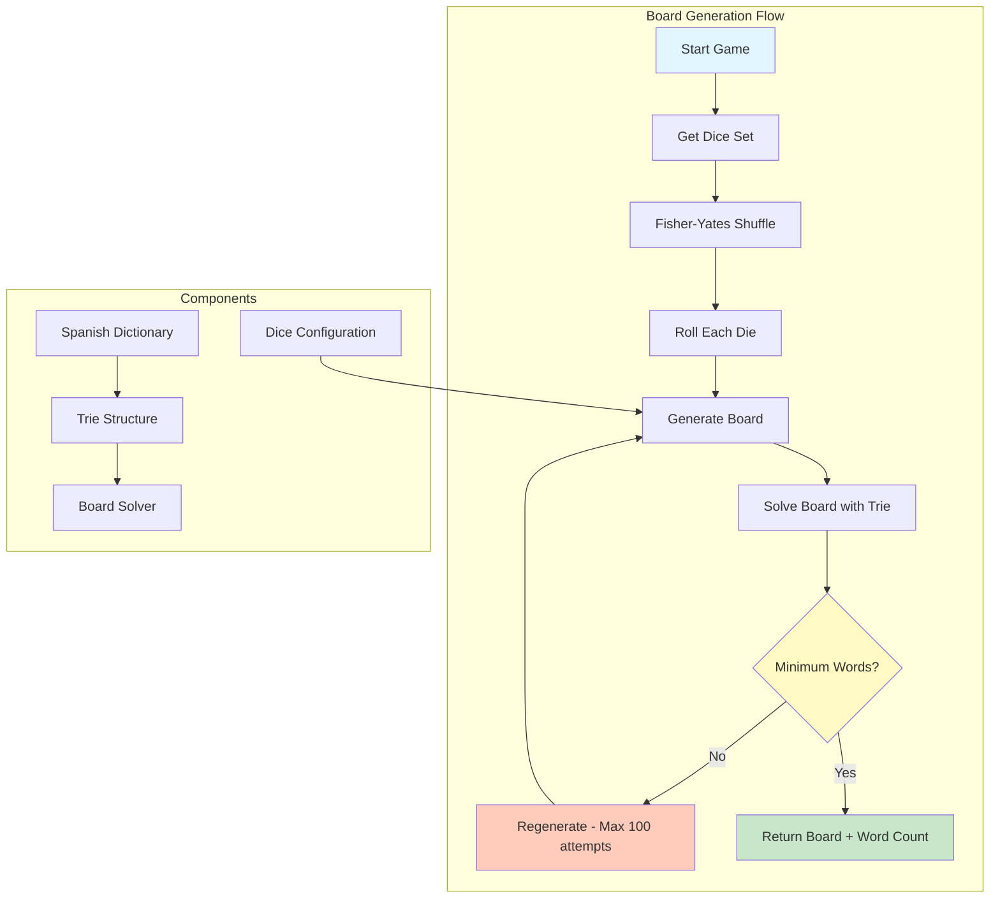
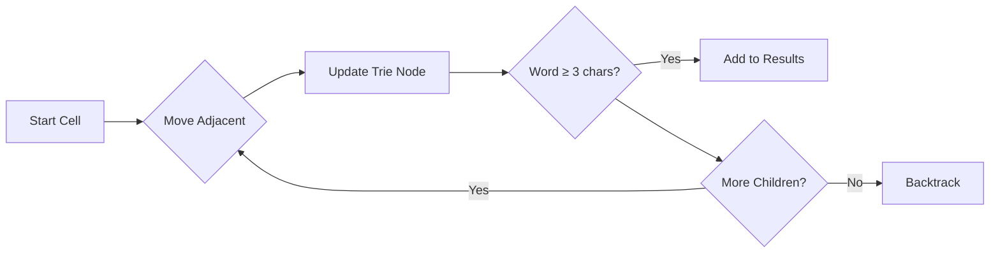

# Boggle Board Generator - Technical Documentation

## Overview

This document describes the improved board generation system for Boggle Party. The system uses **specialized Spanish dice** instead of letter frequency formulas, ensuring better word distribution and playability.

---

## Architecture



---

## Dice Configuration

### Design Principles

The dice are designed with Spanish letter frequencies in mind:

1. **Vowel-heavy dice** - Spanish has 5 vowels (A, E, I, O, U) that appear frequently
2. **Common consonants** - R, L, S, T, D, N appear regularly
3. **Special treatment for QU** - Treated as a single unit for valid Spanish words
4. **Ñ inclusion** - One die per grid size includes Ñ

### 4×4 Grid (16 Dice)

Each die has 6 faces with carefully chosen letter combinations:

| Die | Faces | Purpose |
|-----|-------|---------|
| 1 | A, E, O, I, U, N | Vowels + common consonant |
| 2 | R, L, S, T, D, N | Common consonants |
| 3 | A, B, C, D, E, L | Beginning letters |
| 4 | E, I, O, S, T, R | High-frequency letters |
| 5 | A, M, O, R, S, E | Common word endings |
| 6 | P, A, R, T, E, S | Plurals and verb forms |
| 7 | C, O, N, T, R, A | Common prefixes |
| 8 | D, E, L, M, N, O | Nasal sounds |
| 9 | E, S, T, A, R, L | Common patterns |
| 10 | I, N, O, S, T, V | Less common but useful |
| 11 | L, A, S, E, R, I | Verb endings |
| 12 | M, E, N, T, O, S | Noun endings |
| 13 | **QU**, E, I, A, O, U | QU dipthong |
| 14 | R, A, S, E, I, O | Vowel combinations |
| 15 | T, I, E, N, D, A | Common word parts |
| 16 | V, E, R, D, A, O | VER, DAO, etc. |

### 5×5 Grid (25 Dice)

Adds 9 specialized dice:
- More consonant variety (ADORES, PUEDOS, SALTER, AGO UHI, BI ENOA, CAS OIE, FU ERAO, GATO SE)
- One die with Ñ: `['Ñ', 'O', 'A', 'E', 'I', 'U']`

### 6×6 Grid (36 Dice)

Adds 11 more specialized dice including:
- HACERI, JUEGOA, LUNASE, MANOSI, PEROSA, SOLOAE, TODOAS, UNOSAE, VIDASE, ZONASE, YAEOIU

---

## Board Generation Algorithm

### `generateBoard(gridSize: GridSize)`

**Process:**
1. Select appropriate dice set based on grid size (4×4, 5×5, 6×6)
2. Shuffle dice using Fisher-Yates algorithm
3. Roll each die (select random face)
4. Construct grid row by row

**Time Complexity:** O(n²) where n = grid size

**Space Complexity:** O(n²) for the board

---

### `generateGoodBoard(gridSize: GridSize)`

**Purpose:** Generate boards with guaranteed minimum word counts

**Algorithm:**
```typescript
do {
  board = generateBoard(gridSize);
  results = solveBoard(board, trieRoot);
  attempts++;

  // Quality thresholds
  const minWords = gridSize === 5 ? 40 : 20;
  const minLen = gridSize === 5 ? 7 : 6;

  if (results.words.length >= minWords && results.maxLen >= minLen) {
    break; // Board is good enough
  }
} while (attempts < 100);
```

**Quality Thresholds:**

| Grid Size | Min Words | Min Longest Word |
|-----------|-----------|------------------|
| 4×4 | 20 words | 6 letters |
| 5×5 | 40 words | 7 letters |
| 6×6 | Default | Default |

---

## Board Solver

The solver uses **Depth-First Search (DFS)** with a Trie for efficient word lookup:



**Key Features:**
- **Trie-based lookup:** O(1) prefix checking
- **Handles QU as single unit:** Treats "QU" as two letters in one cell
- **8-directional movement:** Standard Boggle rules (horizontal, vertical, diagonal)
- **No cell reuse:** Each cell used once per word
- **Minimum word length:** 3 characters

---

## Dictionary Optimization

### Original Dictionary
- **Size:** 636,598 words
- **Source:** `an-array-of-spanish-words` npm package

### Cleaned Dictionary
- **Size:** 153,894 words
- **Reduction:** ~76%
- **File:** `data/dictionary_clean.json`

### Cleaning Criteria

The `scripts/clean-dictionary.js` script applies the following filters:

#### 1. Length Filter
```javascript
if (word.length < 3 || word.length > 8) return false;
```
- Keeps words between 3-8 characters (optimal for Boggle)

#### 2. Q Without U
```javascript
if (word.includes('q') && !word.includes('qu')) return false;
```
- Spanish Q is always followed by U

#### 3. Rare Verb Endings
```javascript
const rareEndings = [
  'isteis', 'asteis', 'ieseis', 'aremos', 'iereis',
  'áramos', 'éramos', 'íramos', 'ásemos',
  'abais', 'íais', 'ereis', 'ireis', 'areis',
  'aban', 'ían', 'aran', 'eran', 'iran', 'asen'
];
```

#### 4. Rare Prefixes
```javascript
const rarePrefixes = [
  'pseudo', 'cuasi', 'infra', 'ultra', 'super', 'hiper',
  'anti', 'contra', 'extra', 'meta', 'para', 'semi',
  'macro', 'micro', 'neo', 'proto', 'retro'
];
```

#### 5. Rare Suffixes (for words > 7 letters)
```javascript
const rareSuffixes = [
  'cion', 'sion', 'dad', 'tad', 'miento', 'mento',
  'ancia', 'encia', 'ismo', 'ista', 'logo', 'fobia'
];
```

#### 6. Consecutive Repeated Letters
```javascript
if (/(.)\\1\\1/.test(word)) return false;
```
- Eliminates words like "mmm" or "rrr" (3+ same letters)

#### 7. Rare Consonant Groups
```javascript
const rareConsonantGroups = /[bcdfghjklmnpqrstvwxyz]{4,}/;
```

#### 8. Weird Patterns
```javascript
const weirdPatterns = [
  /[wkx]/,                    // Rare letters
  /[aeiou]{4,}/,              // Too many vowels
  /^[bcdfghjklmnpqrstvwxyz]{3}/, // 3 consonants start
  /[bcdfghjklmnpqrstvwxyz]{3}$/, // 3 consonants end
];
```

### Frequency Scoring

Words are scored and filtered:
```javascript
function getFrequencyScore(word) {
  let score = 0;

  // Common letters (AEIOURLNSDT) = 2 points
  // Other letters = 1 point
  // Rare letters (WKX) = -10 points
  // Ideal length (4-6) = +5 points

  return score;
}

// Minimum score threshold: 10
const SCORE_THRESHOLD = 10;
```

---

## API Changes

### Start Game Endpoint

**New Response Field:**
```typescript
{
  success: true,
  message: "Game started",
  startTime: number,
  duration: number,
  board: string[][],
  totalPossibleWords: number  // NEW!
}
```

The `totalPossibleWords` field lets the frontend show players how many words could have been found.

---

## Performance

### Dictionary Loading

| Operation | Time | Notes |
|-----------|------|-------|
| Load dictionary | ~500ms | One-time on startup |
| Build Trie | ~200ms | Could be cached |
| Solve 4×4 board | ~50ms | DFS with Trie |
| Solve 5×5 board | ~100ms | 25 cells |
| Solve 6×6 board | ~200ms | 36 cells |

### Memory

| Component | Size |
|-----------|------|
| Raw dictionary | 7.9 MB (JSON) |
| Cleaned dictionary | ~2 MB |
| Trie structure | ~5 MB |
| Room state (in-memory) | <1 KB per room |

---

## Configuration

### Environment Variables

No new variables required. Uses existing database configuration.

### Constants

Located in `src/server/board-generator.ts`:

```typescript
export const SPANISH_BOGGLE_DICE_4x4: string[][];  // 16 dice
export const SPANISH_BOGGLE_DICE_5x5: string[][];  // 25 dice
export const SPANISH_BOGGLE_DICE_6x6: string[][];  // 36 dice
```

---

## Future Improvements

### Dictionary Cleanup

The cleaned dictionary can be further optimized:

- [ ] Add more common verb forms
- [ ] Include more compound words
- [ ] Add regional Spanish variants
- [ ] Validate against real Spanish corpus

### Board Generation

- [ ] Add difficulty levels (easy/medium/hard)
- [ ] Theme boards (animals, food, colors)
- [ ] Ensure minimum vowel distribution
- [ ] Cache pre-solved boards for faster startup

---

## Usage Examples

### Generate a Board

```typescript
import { generateBoard, generateGoodBoard } from '@/server/board-generator';

// Simple random board
const board4x4 = generateBoard(4);
// => [['A', 'R', 'T', 'S'], ...]

// Board with quality guarantee
const { board, allWords } = await generateGoodBoard(5);
// => { board: [['M', 'E', 'N', 'T', 'O'], ...], allWords: ['MENTO', 'MONTA', ...] }
```

### Solve a Board

```typescript
import { solveBoard } from '@/server/solver';
import { buildTrie } from '@/server/dictionary';

const dictSet = await getDictionary();
const trieRoot = buildTrie(dictSet);
const result = solveBoard(board, trieRoot);

console.log(`Found ${result.words.length} words`);
console.log(`Longest word: ${result.maxLen} letters`);
```

### Get Board Statistics

```typescript
import { getBoardStats } from '@/server/board-generator';

const stats = getBoardStats(board);
// => {
//   totalCells: 16,
//   uniqueLetters: 12,
//   letterCounts: { A: 2, E: 3, ... },
//   mostFrequent: 'E'
// }
```

---

## Troubleshooting

### Board Takes Too Long to Generate

**Problem:** `generateGoodBoard` exceeds 100 attempts

**Solution:**
- Check dice configuration for letter balance
- Increase word count thresholds
- Pre-generate and cache solved boards

### Too Many/Too Few Words

**Problem:** Board has less than 20 words (4×4)

**Solution:**
- Adjust `minWords` threshold in `generateGoodBoard`
- Review dice face distribution
- Check dictionary cleaning criteria

### Dictionary Loading Slow

**Problem:** `getDictionary()` takes > 1 second

**Solution:**
- Use cleaned dictionary (`dictionary_clean.json`)
- Implement Trie caching
- Consider Redis for dictionary storage

---

## References

- [Spanish Letter Frequency](https://en.wikipedia.org/wiki/Letter_frequency#Spanish)
- [Boggle Rules](https://en.wikipedia.org/wiki/Boggle)
- [Trie Data Structure](https://en.wikipedia.org/wiki/Trie)
